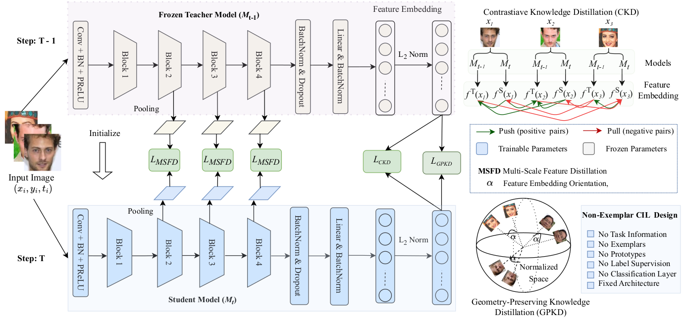

# CLFace: A Scalable and Resource-Efficient Continual Learning Framework for Lifelong Face Recognition (WACV 2025)

[https://arxiv.org/pdf/2411.13886](arxiv)

 

## Introduction
We introduce CLFace, a continual learning framework designed to preserve and incrementally extend the learned knowledge. CLFace eliminates the classification layer, resulting in a resource-efficient FR model that remains fixed throughout lifelong learning and provides label-free supervision to a student model, making it suitable for open-set face recognition during incremental steps. We introduce an objective function that employs feature-level distillation to reduce drift between feature maps of the student and teacher models across multiple stages. Additionally, it incorporates a geometry-preserving distillation scheme to maintain the orientation of the teacher model’s feature embedding. Furthermore, a contrastive knowledge distillation is incorporated to continually enhance the discriminative power of the feature representation by matching similarities between new identities. 

## Update
* [2024.11.26] Paper and README.md updated
* [2024.11.22]: Code Released !


## Pre-trained models
* Will be provided later


## Requirements
* [PyTorch](https://pytorch.org/) version >= 2.5.1

* Install other libraries via
```
pip install -r requirements.txt
```


## Training
### Datasets
* Will be provided later

## Citation
If you use our work, please cite:
```
@article{hasan_2024_clface,
  title={CLFace: A Scalable and Resource-Efficient Continual Learning Framework for Lifelong Face Recognition},
  author={Hasan, Md Mahedi and Sami, Shoaib Meraj and Nasrabadi, Nasser},
  journal={arXiv preprint arXiv:2411.13886},
  year={2024}
}
}
```

## Acknowledgement
This code borrows heavily from [PODNeT](https://github.com/arthurdouillard/incremental_learning.pytorch) repository. Many thanks

